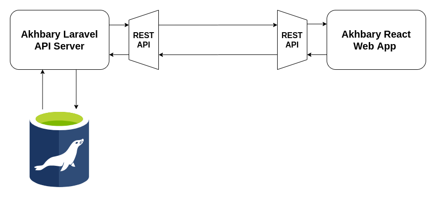

# Akhbary

Akhbary is an open-source news outlet that allows you to browse the latest hot headlines and make a list of your favorite headlines.

## Motivation
This is project is a simple demo for full stack pipeline using Laravel and React. It covers all stages of development form basic frontend to backend and database APIs.

## System Architecture
As mentioned before the system is devided into 2 sub projects:

1. [A Laravel API](./AkhbaryServer)
2. [React Web App](./akhbary-webapp)

The apps comunicate throw the following API:

